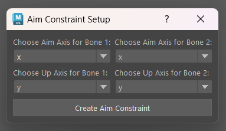

# LocatorToBonesAim

The `LocatorToBonesAim` script in Maya creates aim constraints between two joints, based on locator positions. This automates the setup of aim constraints, which is often used to align one object to face another.


## Installation

1. Place the `LocatorToBonesAim.py` file in the `scripts` folder of your Maya directory.

## Usage

To use the script, execute the following commands in Maya's script editor or Python command line:

```python
import LocatorToBonesAim
LocatorToBonesAim.show_aim_constraint_dialog()
```

A dialog box will appear for setting up aim constraints. Select two locators and specify the aim and up axes for the bones that will be created at the locators' positions. The script will create two bones and set up aim constraints based on your selections.
